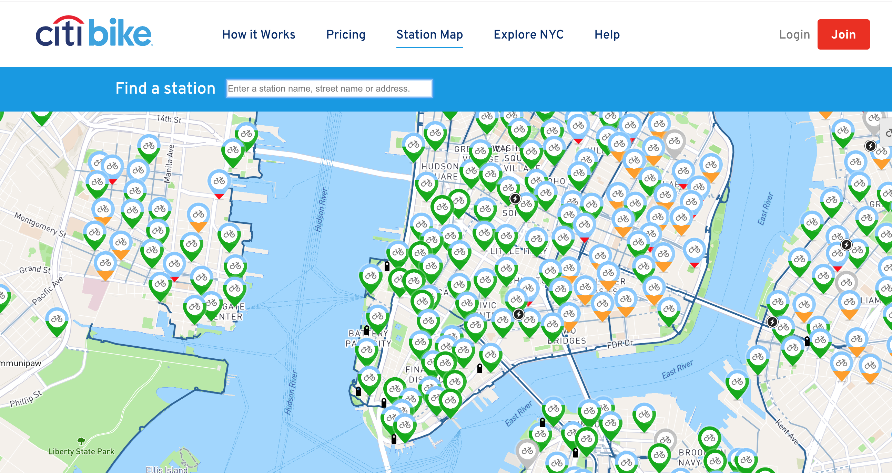

# Citi-Skateboard-App
A skateboard version of citi-bike app

## Project Overview
The city of NYC plans to deploy skateboard stations across town. Registered users can check out boards and stops and return them to other boards. You will implement the management system for this service. Your system will accept check-out/check-in reports, track the skateboards, answer queries about stations (e.g. empty/full) and be the backend for user registration. In addition you will support offline batch computation on logged data, and implement such a computation as a proof-of-contents. For example, you could run a batch job that generates a station-balancing report (how and where to move bikes).


## Project Design: 
A two to four pages Google doc describing exactly what you plan to do. The design will include the following information:
* The high level and detailed design. Best to include an architecture diagram in this section.
* The languages and technologies you intend to use (e.g. list the open source tools you intend to use).
* The exact scope of the project. What you intend to do and what you don’t.
* The breakdown of tasks by project members. Who is in charge of what.

## Tech Stack


## Data Model

(___TODO__: a description of your application's data and their relationships to each other_) 

The application will store Users, Lists and Items

* users can have multiple lists (via references)
* each list can have multiple items (by embedding)

(___TODO__: sample documents_)

An Example User:

```javascript
{
  username: "shannonshopper",
  hash: // a password hash,
  lists: // an array of references to List documents
}
```

An Example List with Embedded Items:

```javascript
{
  user: // a reference to a User object
  name: "Breakfast foods",
  items: [
    { name: "pancakes", quantity: "9876", checked: false},
    { name: "ramen", quantity: "2", checked: true},
  ],
  createdAt: // timestamp
}
```


## [Link to Commented First Draft Schema](db.js) 

(___TODO__: create a first draft of your Schemas in db.js and link to it_)

## Wireframes

(___TODO__: wireframes for all of the pages on your site; they can be as simple as photos of drawings or you can use a tool like Balsamiq, Omnigraffle, etc._)

/ - page for all stations on the map



/list - page for showing all shopping lists


/list/slug - page for showing specific shopping list


## Site map

(___TODO__: draw out a site map that shows how pages are related to each other_)

Here's a [complex example from wikipedia](https://upload.wikimedia.org/wikipedia/commons/2/20/Sitemap_google.jpg), but you can create one without the screenshots, drop shadows, etc. ... just names of pages and where they flow to.

## User Stories or Use Cases

1. As non-registered user, you can see all the skateboards stations
2. As non-registered user, you can check number of skateboards at each station, empty or full query reports
3. As non-registered user, you can create an account
4. As a user, you can check-in skateboard
5. As a user, you can check-out skateboard


## Tasks by Team Member

(___TODO__: the research topics that you're planning on working on along with their point values... and the total points of research topics listed_)

* (5 points) Integrate user authentication
    * I'm going to be using passport for user authentication
    * And account has been made for testing; I'll email you the password
    * see <code>cs.nyu.edu/~jversoza/ait-final/register</code> for register page
    * see <code>cs.nyu.edu/~jversoza/ait-final/login</code> for login page
* (4 points) Perform client side form validation using a JavaScript library
    * see <code>cs.nyu.edu/~jversoza/ait-final/my-form</code>
    * if you put in a number that's greater than 5, an error message will appear in the dom
* (5 points) vue.js
    * used vue.js as the frontend framework; it's a challenging library to learn, so I've assigned it 5 points

10 points total out of 8 required points (___TODO__: addtional points will __not__ count for extra credit_)


## [Link to Initial Main Project File](app.js) 

(___TODO__: create a skeleton Express application with a package.json, app.js, views folder, etc. ... and link to your initial app.js_)

## Annotations / References Used

(___TODO__: list any tutorials/references/etc. that you've based your code off of_)

1. [passport.js authentication docs](http://passportjs.org/docs) - (add link to source code that was based on this)
2. [tutorial on vue.js](https://vuejs.org/v2/guide/) - (add link to source code that was based on this)
